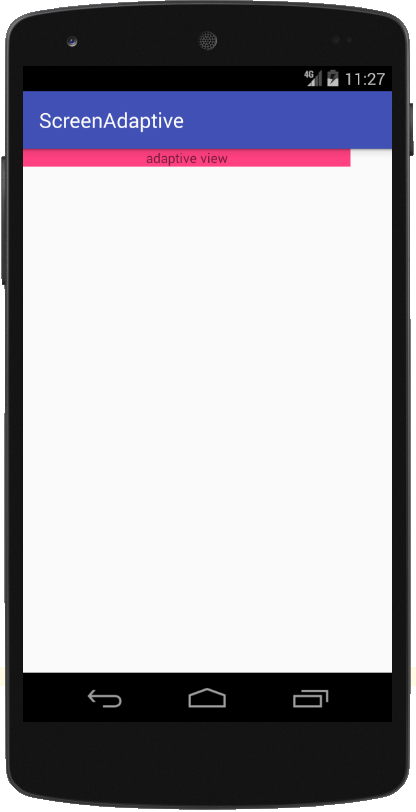
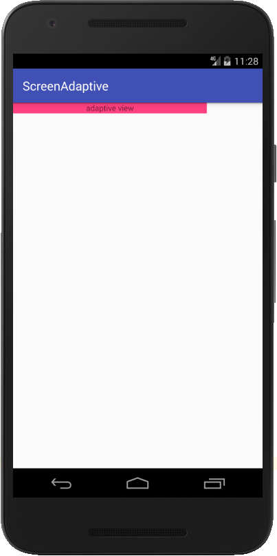
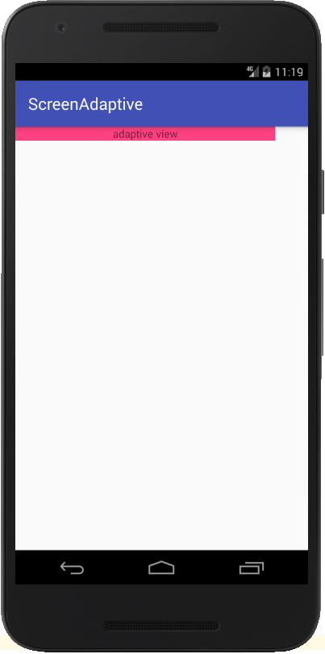

# Demo
Blog文章demo

## StatusBarDemo

- 效果图


- 使用

```    
    // 设置透明状态栏，需放在setContentView之前调用
    StatusBarUtils.setTransparentStatusBar(this, false);
    // 更改状态栏字体图标颜色
    StatusBarUtils.setStatusTextColor(!isNight, MainActivity.this);
```

## ScreenAdaptiveDemo

> 该demo**可以适配屏幕**，**也可以适配字体**，保证字体不会因为系统设置更改而变化

- 效果图（**适配前**，**左**：480像素密度[1080*1920 4.95寸 Nexus 5] **右**：420像素密度[1080*1920 5.2寸 Nexus 5X]）



- 效果图（**适配后**，**左**：480像素密度[1080*1920 4.95寸 Nexus 5] **右**：420像素密度[1080*1920 5.2寸 Nexus 5X]）



- 使用

> 如果适配当前页面

```
// 在Application中onConfigurationChanged方法里设置
AdaptiveUtil.resetDensity(this)

// 在Activity中setContentView之前设置
AdaptiveUtil.resetDensity(MainActivity@this)
```

> 如果适配整个项目

```
// 在Application中onConfigurationChanged方法里设置
AdaptiveUtil.resetDensity(this)

// 在Application中onCreate方法里设置设置
AdaptiveUtil.resetDensity(this)
```
